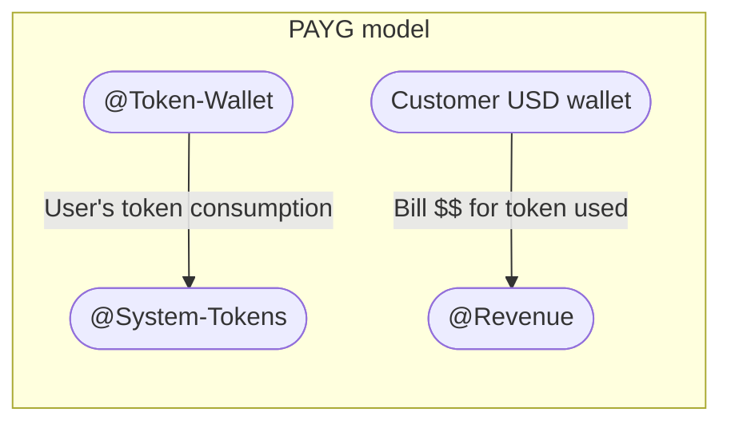
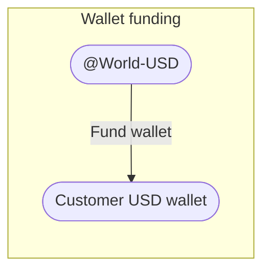
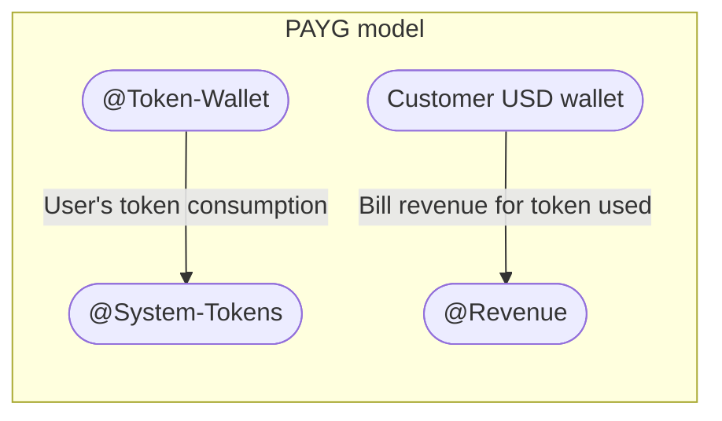

# AI Billing: How to Build Monetization & Cost Tracking for AI Agents with Blnk

Content Type: Article
Last edited time: October 21, 2025 3:33 PM
Status: Clean up

Everyone loves a good AI product: calendars, banking, e-commerce, education, research, design, engineering, etc. 

As AI tools have become more common, teams building them have widely adopted usage-based pricing as the go-to billing model for their products.

Building usage-based billing starts out simple until you need to handle pricing for thousands of customers across different AI models, each with its own rate and usage behaviour. So how do you do it?

In this guide, we’ll walk through how to set up the core infrastructure behind an AI billing system. These steps cover setting up your ledger, creating and managing balances for your users’ subscriptions, invoicing, and enabling money movement.

## Modelling your AI billing system

Let’s start with the basics. Every usage event in your AI product has two parts:

- **Tokens:** How much was consumed, typically measured and reported by your AI provider.
- **Dollars:** The monetary value of that consumption, i.e. how much it costs based on your pricing model.

Since both parts serve as halves of a whole, they should always be recorded together in one system — your single source of truth. 

Why is this important? Because in most billing setups, these components are managed separately — tokens in provider dashboards, costs in card statements, and customer charges in your own system.

That separation creates room for error: missing logs, duplicate retries, overcharges, and ultimately, mismatched balances that frustrate customers.

### 1: Decide how you’ll track usage per customer

Most AI providers issue a single usage wallet per organization. This means it’s up to you to determine which usage belongs to which customer.

To track usage and invoices accurately at customer level, you’ll need to [create a wallet](https://www.notion.so/Building-a-wallet-28e8d89dedc8808a99cfd12bee57b94d?pvs=21) for each customer. This setup allows you to:

- Attribute every token used to the right customer.
- Generate accurate usage-based invoices without mixing data across customers.
- Enforce limits or apply discounts per wallet.

### 2: Define your money movement map

A [Money movement map](https://docs.blnkfinance.com/ledgers/money-movement-map) refers to how money (or assets) move in your application. It gives you a visual blueprint for how transactions should be recorded across different workflows.

For example, most AI billing systems have two core workflows that move money:

- Wallet funding
- Token usage — whether prepaid or postpaid

Earlier, we established that each usage event should always record two components together: **tokens** and **dollars**. Here’s what that looks like in our money movement map:



After each usage:

- The number of tokens consumed is recorded internally.
- The corresponding USD value is debited from the customer’s wallet and credited to your revenue account.
- Both actions occur together in a single atomic write, ensuring every token record has a matching customer debit transaction.

### 3: Choosing your double-entry ledger

A [ledger](https://www.blnkfinance.com/products/core) serves as your source of truth for all transactions within your system, ensuring:

- Transactions are immutable and idempotent.
- Accurate balances being kept for your customers.
- Reliable record keeping for audit needs.

<aside>


Billing is an accounting problem, not just analytics. Your goal is to ensure that every event is traceable and auditable to the smallest cent.

</aside>

Because AI providers only issue one wallet per organization, a ledger helps you keep track of usage and cost at the customer level like we planned in Step 1.

For this guide, we’ll use [Blnk Core](https://www.blnkfinance.com/products/core) as our ledger infrastructure. You can install it [here](https://docs.blnkfinance.com/home/install).

## Setting up your ledger

Before implementing the billing workflows, you need to set up your ledger. 

### 1: Create ledger

We’ll start with a ledger folder. A ledger folder in Blnk helps you group similar balances together. For this guide, we want a ledger for our customers’ balances.

To create our ledger, make the following API call to our [**Create Ledger**](https://docs.blnkfinance.com/ledgers/introduction#creating-a-ledger) endpoint:

```bash
curl -X POST http://localhost:5001/ledgers \
  -H "Content-Type: application/json" \
  -H "X-Blnk-Key: YOUR_API_KEY" \
  -d '{
    "name": "Customers Ledger"
  }'
```

The response includes a `ledger_id` which you’ll use to create the customer’s wallet balance in Step 2.

### 2: Create customer wallet

Next, create a balance for each customer in your system. In this example, we’ll create a balance for “Xavier Woods.” Make a request to our [**Create Balance**](https://docs.blnkfinance.com/balances/introduction#creating-a-balance) endpoint:

```bash
curl -X POST http://localhost:5001/balances \
  -H "Content-Type: application/json" \
  -H "X-Blnk-Key: YOUR_API_KEY" \
  -d '{
    "ledger_id": "ldg_90b6806c-98a9-4e4b-842b-581e4a918faf",
    "currency": "USD",
    "meta_data": {
	    "name": "Xavier Woods"
    }
  }'
```

The response includes a `balance_id` which you’ll use when recording transactions to the customer’s balance. 

Optionally, you can create a customer identity in Blnk and link it to the balance, rather than storing the customer’s name in metadata. Learn more about [linking balances here](https://docs.blnkfinance.com/identities/link-balances#link-identity-to-a-balance)

## Wallet top-up

Xavier wants to add $120.00 to his account. To do this, you’ll need to create a transaction that adds money to his balance in your ledger. 

The money movement map for this is:



To implement this with Blnk, make a request to the [Create Transaction](https://docs.blnkfinance.com/transactions/introduction) endpoint:

```bash
curl -X POST http://localhost:5001/transactions \
  -H "Content-Type: application/json" \
  -H "X-Blnk-Key: YOUR_API_KEY" \
  -d '{
    "amount": 120,
    "currency": "USD",
    "precision": 100,
    "reference": "ai-billing_ref-001",
    "source": "@World-USD",
    "destination": "bln_964e2037-c399-4f46-b566-6a84681600f7",
    "description": "Wallet funding",
    "allow_overdraft": true
  }'
```

**Note:** Blnk enforces [double-entry accounting](https://docs.blnkfinance.com/guides/double-entry) through the source and destination fields.
The source represents where funds are deducted from, while the destination represents where they are credited to.

Also:

- **amount –** The value to transfer (e.g. 43.23);
- **precision –**  Converts the amount to its smallest unit (e.g. 100 converts to dollar amounts to cents). This helps you avoid rounding errors that are common with floating-point arithmetic.
- **currency –** All currencies are support: fiat and crypto. You can also use custom currencies as well, e.g. TOKENS.

<aside>


In Blnk, instead of balance IDs, you can use **indicator names** (like `@World-USD` or `@Revenue`) to reference wallets owned by your application. They’re automatically grouped under your **General Ledger**.

</aside>

Learn more about recording transactions in Blnk [here](https://docs.blnkfinance.com/transactions/introduction#recording-a-transaction).

## Manage billing

To record usage in your ledger, you first need to know **how many tokens** your AI model consumed and **what that usage is worth in USD**.

### 1: Connect to your LLM

You’ll start by connecting to your provider. For this guide, we’ll use the Open AI TypeScript SDK:

```jsx
import OpenAI from "openai";
export const openai = new OpenAI({ apiKey: process.env.OPENAI_API_KEY! });
```

### 2: Capture token usage

Next, you can make a completion request and extract how many input and output tokens were used after each usage event. 

```jsx
export async function runCompletion(model: string, prompt: string) {
  const response = await openai.responses.create({
    model,
    input: [{ role: "user", content: prompt }],
  });

  const inputTokens = response.usage?.input_tokens ?? 0;
  const outputTokens = response.usage?.output_tokens ?? 0;

  return { inputTokens, outputTokens, totalTokens: inputTokens + outputTokens };
}

```

### 3: Calculate the corresponding USD value

Each model has its own rate for input and output tokens. After retrieving the token counts, calculate the cost for each, then add them together to get the total usage cost.

```jsx
const MODEL_RATES = {
  "gpt-4.1-mini": { inputPer1K: 0.30, outputPer1K: 1.20 },
  "gpt-4o-mini":  { inputPer1K: 0.15, outputPer1K: 0.60 },
};

export function calculateUSD(model: string, inputTokens: number, outputTokens: number) {
  const rate = MODEL_RATES[model];
  if (!rate) throw new Error(`No pricing configured for model: ${model}`);

  const inputCost = (inputTokens / 1000) * rate.inputPer1K;
  const outputCost = (outputTokens / 1000) * rate.outputPer1K;

  return inputCost + outputCost;
}

```

### 4: Record token usage in your ledger

Like we defined earlier in our money movement map, both the token usage and dollar cost will be recorded together as one atomic write.



To do this with Blnk, make a request to our **Bulk Transaction** endpoint:

```bash
curl -X POST http://localhost:5001/transactions/bulk \
  -H "Content-Type: application/json" \
  -H "X-Blnk-Key: YOUR_API_KEY" \
  -d '{
    "atomic": true,
    "run_async": false,
    "transactions": [
	    {
		    "amount": 2290,
		    "precision": 1,
		    "currency": "TOKENS",
		    "reference": "ref_ai-billing_001_tokens",
		    "source": "@Token-Wallet",
		    "destination": "@System-Tokens",
		    "description": "Token leg",
		    "allow_overdraft": true
	    },
	    {
		    "amount": 60.25,
		    "precision": 100,
		    "currency": "USD",
		    "reference": "ref_ai-billing_001_usd",
		    "source": "bln_964e2037-c399-4f46-b566-6a84681600f7",
		    "destination": "@Revenue",
		    "description": "USD leg",
		    "allow_overdraft": false
	    }
    ]
  }'
```

This workflow ensures that customers are charged accurately for what they use. The response includes a `batch_id`, which serves as the key linking both legs of the transaction in your ledger.

**Note:** You can use `meta_data` to attach extra details to each transaction, such as the model name, prompt type, or customer ID if you wish to.

Also:

- **precision = 1:** Tokens aren’t measured in decimals, so the precision is set to 1 by default.
- **reference:** Use a stable, unique identifier for easy tracing. For example, include the customer ID, model, timestamp, and transaction type in the reference, e.g. `ref_cus123_gpt40mini_1294892983_tokens` and `ref_cus123_gpt40mini_1294892983_usd`.

## Handling prepaid vs postpaid

With prepaid billing, the customer funds their wallet before using your product. As they consume tokens:

- The corresponding dollar cost is deducted from the customer wallet.
- If the wallet balance becomes insufficient or reaches zero, the transaction fails and the workflow stops.
- The customer must top up their wallet to continue using the product.

With postpaid billing, the flow works differently:

- The customer doesn’t need to fund their wallet in advance.
- As usage accumulates, the balance moves into overdraft (using `allow_overdraft: true` in the dollar leg of the transaction)
- The overdraft balance represents how much the customer owes.
- At the end of the billing period, you can retrieve this overdraft amount to generate an invoice.
- Once payment is made, the balance resets to zero and the next cycle begins.

## Wrapping it up

Congratulations! You’ve just built an AI billing system that finally gets accuracy right.

Here’s what we did:

- Implemented a [wallet system](https://docs.blnkfinance.com/tutorials/quick-start/wallet-management) to track usage per customer.
- Linked token usage and dollar cost atomically in the ledger — works for one or multiple LLM models.
- Enabled both prepaid and postpaid billing without breaking anything.

If you have any questions about this guide, reach out on [Discord](https://discord.gg/7WNv94zPpx) or send us a message.