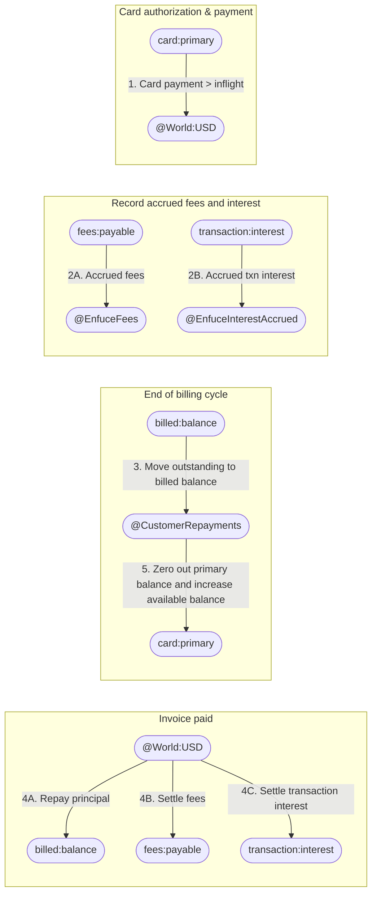

# POC Integration Doc | Enfuce

Category: User Generated

## Overview

This is an overview of how money moves for the Charge Card use case:



## 1 → 1a – Create card account and sub-balances

---

- **Workflow**
    - Create a ledger for the card account. This will group all of the balances into their own separate ledger
    - Create all balances underneath the card account linked to the same customer
        - **card_primary →** main charge card balance
        - **fees_payable →** tracks all fees accrued by the customer in the billing cycle
        - **transaction_interest →** tracks all interest accrued by pending transactions.
        - **billed_balance →** tracks principal to be billed to the customer.
        - **overdue_balance →** tracks overdue principal yet to be paid by customer
        - **overdue_interest →** tracks interest accrued on overdue principal

---

- **Code implementation**
    - Create a ledger:
        
        ```bash
        curl -X POST http://localhost:5001/ledgers \
        -H 'Content-Type: application/json' \
        -H 'X-Blnk-Key: YOUR_API_KEY' \
        -d '{
        	"name": "Xavier Woods Card Ledger"
        }'
        ```
        
    - Create customer identity:
        
        ```bash
        curl -X POST http://localhost:5001/identities \
        -H 'Content-Type: application/json' \
        -H 'X-Blnk-Key: YOUR_API_KEY' \
        -d '{
        	"first_name": "Xavier",
        	"last_name": "Woods"
        }'
        ```
        
    - Create each sub-balance using the same `ledger_id` and `identity_id` from the first two requests:
        
        ```bash
        curl -X POST http://localhost:5001/balances \
        -H 'Content-Type: application/json' \
        -H 'X-Blnk-Key: YOUR_API_KEY' \
        -d '{
        	"ledger_id": "<xavier-ledger-id>",
        	"identity_id": "<xavier-identity-id>",
        	"currency": "USD",
        	"meta_data": { "type": "card:primary" }
        }'
        ```
        

---

- **Documentation reference**
    - **Create ledgers** → [https://docs.blnkfinance.com/ledgers/introduction](https://docs.blnkfinance.com/ledgers/introduction)
    - **Create identities** → [https://docs.blnkfinance.com/identities/introduction](https://docs.blnkfinance.com/identities/introduction)
    - **Create balances** → [https://docs.blnkfinance.com/balances/introduction](https://docs.blnkfinance.com/balances/introduction)

---

## 2 → 4 – Auth comes from processor and ledger validates available balance before creating transaction

---

- **Workflow**
    - Create an overdraft transaction from the **`card_primary`** balance and set an overdraft limit:
        - Overdraft puts the customer balance in negative signifying how much is owed to you.
        - The overdraft limit specifies how much is available for the customer to spend.
            
            > Blnk automatically rejects any transaction that attempts to exceed the limit.
            > 
    - Set `inflight = true` for this transaction. This puts the transaction in a ‘pending’ state until it is settled or not. Pending balances can be tracked in the inflight balance attribute.
    - If successfully inflight, the processor can go ahead with the transaction. If ledger returns rejected, the processor voids the transaction.

---

- **Code implementation**
    
    Create overdraft transaction with overdraft limit and inflight. The sample code below sets a limit of $5,000.00, i.e. the source, **`card_primary`**, cannot spend more than $5,000.00 in this transaction.
    
    ```bash
    curl -X POST http://localhost:5001/transactions \
    -H 'Content-Type: application/json' \
    -H 'X-Blnk-Key: YOUR_API_KEY' \
    -d '{
    	"amount": 2000,
    	"precision": 100,
    	"currency": "USD",
    	"reference": "<unique-reference>",
    	"source": "<card_primary_balance_id>",
    	"destination": "@World-USD",
    	"description": "Card transaction",
    	"allow_overdraft": true,
    	"overdraft_limit": 5000,
    	"inflight": true
    }'
    ```
    
    Your transaction will be recorded successfully and it will be on **`INFLIGHT`** (pending a commit or void action).
    
    > You can try out the same code above with an amount higher than the overdraft limit. You will see the **`REJECTED`** transaction in your dashboard.
    > 

---

- **Documentation reference**
    - **How Blnk calculates available balance:** [https://docs.blnkfinance.com/transactions/introduction#managing-insufficient-funds](https://docs.blnkfinance.com/transactions/introduction#managing-insufficient-funds)
    - **Overdrafts:** [https://docs.blnkfinance.com/transactions/overdrafts](https://docs.blnkfinance.com/transactions/overdrafts)
    - **Inflight transactions:** [https://docs.blnkfinance.com/transactions/inflight](https://docs.blnkfinance.com/transactions/inflight)
    - **Why use “@WorldUSD”?** [https://docs.blnkfinance.com/balances/internal-balances](https://docs.blnkfinance.com/balances/internal-balances)

---

## 5 → 6 – Auth comes from ATM and ledger validates available balance before creating transaction

---

- **Workflow**
    - The same workflow in **2 → 4** applies here.
    - Using the same overdraft limit from the previous step, Blnk automatically calculates the remaining available balance, i.e. if you have $2,000.00 from the previous transaction still inflight, then your available balance is $3,000.00
        
        This means that this ATM transaction will not be successful if the amount attempted is more than $3,000.00. Blnk will reject the transaction due to the overdraft limit being exceeded.
        

---

## 6a → 6b – Auto mark-up fee & interest bearing

---

- **Workflow**
    
    Because these amounts are yet to be paid by the user, record them as overdraft:
    
    - Calculate the 1.5% markup and record the fee payable from **`fees_payable`** to **`@EnfuceFees`** balance.
    - Record the interest accrued on the pending transaction from **`transaction_interest`** to **`@EnfuceInterestAccrued`**.
    
    > You can optionally link them to the original card transaction by linking its reference or transaction id in their metadata.
    > 

---

- **Code implementation**
    - Markup fee:
        
        ```bash
        curl -X POST http://localhost:5001/transactions \
        -H 'Content-Type: application/json' \
        -H 'X-Blnk-Key: YOUR_API_KEY' \
        -d '{
        	"amount": 30,
        	"precision": 100,
        	"currency": "USD",
        	"reference": "<unique-reference>",
        	"source": "<fees_payable_balance_id>",
        	"destination": "@EnfuceFees",
        	"description": "1.5% fees of card transaction",
        	"allow_overdraft": true
        }'
        ```
        
    - Interest bearing/accrued on pending transactions done periodically:
        
        ```bash
        curl -X POST http://localhost:5001/transactions \
        -H 'Content-Type: application/json' \
        -H 'X-Blnk-Key: YOUR_API_KEY' \
        -d '{
        	"amount": 2000,
        	"precision": 100,
        	"currency": "USD",
        	"reference": "<unique-reference>",
        	"source": "<transaction_interest_balance_id>",
        	"destination": "@EnfuceInterestAccrued",
        	"description": "Interest accrued on pending transaction",
        	"allow_overdraft": true
        }'
        ```
        

---

## 7 → 8 – Clearing

---

- **Workflow**
    - Commit the inflight (pending) transaction from **2 → 4 and 5 → 6** once clearing is received. This turns the inflight transaction to **`APPLIED`**, i.e. completed.
    - If fee is recalculated and different, refund the previous fee transaction to cancel it; then post the recalculated one.
    - Once cleared, transaction interest should stop accruing

---

- **Code implementation**
    - Commit the inflight transaction once cleared:
        
        ```bash
        curl -X PUT http://localhost:5001/transactions/inflight/<transaction_id> \
        -H 'Content-Type: application/json' \
        -H 'X-Blnk-Key: YOUR_API_KEY' \
        -d '{
        	"status": "commit"
        }'
        ```
        
    - If fee recalculated is different, refund previous fee transaction to cancel it out, then post the recalculated one.
        
        ```bash
        # Refund
        
        curl -X POST http://localhost:5001/transactions/refund-transaction/<transaction_id> \
        -H 'Content-Type: application/json' \
        -H 'X-Blnk-Key: YOUR_API_KEY'
        
        # Post recalculated transaction
        
        curl -X POST http://localhost:5001/transactions \
        -H 'Content-Type: application/json' \
        -H 'X-Blnk-Key: YOUR_API_KEY' \
        -d '{
        	"amount": 30,
        	"precision": 100,
        	"currency": "USD",
        	"reference": "<unique-reference>",
        	"source": "<fees_payable_balance_id>",
        	"destination": "@EnfuceFees",
        	"description": "1.5% fees of card transaction",
        	"allow_overdraft": true
        }'
        ```
        

---

- **Documentation reference**
    - Applying inflight: [https://docs.blnkfinance.com/transactions/inflight#4-updating-inflight](https://docs.blnkfinance.com/transactions/inflight#4-updating-inflight)
    - Refund transactions: [https://docs.blnkfinance.com/transactions/refunds](https://docs.blnkfinance.com/transactions/refunds)

---

## At this stage (during the billing cycle)

The following balances would be negative indicating that they’re outstanding amounts yet to be paid by the customer:

- **`card_primary` →** Shows the principal to be billed at the end of the cycle. It also has all of the cleared/completed card transactions for invoice generation.
- **`fees_payable` →** Shows the fees accrued by the user from their card transactions.
- **`transaction_interest` →** Shows the interest accrued per time spent in the pending state

## 9 – End of billing cycle

---

- **Workflow**
    - Retrieve all the completed transactions that happened in the billing cycle for the invoice. It should always equal the outstanding balance on **`card_primary`**.
    - Post a transaction that updates the **`billed_balance`** with the total amount to be billed for that cycle. This mirrors the **`card_primary`** balance for the billing cycle and is negative as well (outstanding amount due)
    - Leave the **`card_primary`** untouched to keep the available balance counting, i.e. if user has used up their limit, they cannot perform any transaction until they clear the due invoice.
    - Retrieve balances of the **`fees_payable`** and **`transaction_interest`** for generating the final invoice.

---

- **Code implementation**
    - Retrieve all completed transactions in the billing cycle:
        
        ```bash
        curl -X POST http://localhost:5001/search/transactions \
        -H 'Content-Type: application/json' \
        -H 'X-Blnk-Key: YOUR_API_KEY' \
        -d '{
        	"q": "<card_primary_balance_id>",
        	"query_by": "source,destination",
        	"filter_by": "created_at:[<start_date>...<end_date>]",
        	"sort_by": "created_at:desc"
        }'
        ```
        
    - Post a transaction that updates the **`billed_balance`** with the total due principal for that cycle:
        
        ```bash
        curl -X POST http://localhost:5001/transactions \
        -H 'Content-Type: application/json' \
        -H 'X-Blnk-Key: YOUR_API_KEY' \
        -d '{
        	"amount": 2000,
        	"precision": 100,
        	"currency": "USD",
        	"reference": "<unique-reference>",
        	"source": "<billed_balance_id>",
        	"destination": "@CustomerRepayments",
        	"description": "Invoice created",
        	"allow_overdraft": true
        }'
        ```
        

---

- **Documentation reference**
    - Search API: [https://docs.blnkfinance.com/search/overview](https://docs.blnkfinance.com/search/overview)

---

## 10 – If invoice is overdue

---

- **Workflow**
    - Move the negative balance from **`billed_balance`** to the **`overdue_balance`.** This keeps the billed balance zeroed out for the next cycle, while the overdue balance tracks the open invoice.
    - Record the interest accrued into the **`overdue_interest`** balance (as an outstanding as well)

---

- **Code implementation**
    - Move the negative balance from **`billed_balance`** to **`overdue_balance` :**
        
        ```bash
        curl -X POST http://localhost:5001/transactions \
        -H 'Content-Type: application/json' \
        -H 'X-Blnk-Key: YOUR_API_KEY' \
        -d '{
        	"amount": 2000,
        	"precision": 100,
        	"currency": "USD",
        	"reference": "<unique-reference>",
        	"source": "<overdue_balance_id>",
        	"destination": "<billed_balance_id>",
        	"description": "Invoice overdue",
        	"allow_overdraft": true
        }'
        ```
        
    - Overdue interest accrued:
        
        ```bash
        curl -X POST http://localhost:5001/transactions \
        -H 'Content-Type: application/json' \
        -H 'X-Blnk-Key: YOUR_API_KEY' \
        -d '{
        	"amount": 20,
        	"precision": 100,
        	"currency": "USD",
        	"reference": "<unique-reference>",
        	"source": "<overdue_interest_balance_id>",
        	"destination": "@EnfuceInterestAccrued",
        	"description": "Interest accrued on due invoice",
        	"allow_overdraft": true
        }'
        ```
        

---

## 11 → 12 – Invoice is paid

---

- **Workflow**
    - If invoice is paid, interest stops to accrue and the amount is spread across the outstanding balance.
        - **`overdue:balance`** if the invoice paid is overdue, or **`billed:balance`** if the invoice paid is right on time.
    - The **`card:primary`** balance is credited with the repaid principal to increase its available balance.
    - The **`overdue:interest`** balance is zeroed by paying it from the **`card:primary`**  balance and included in the next billing cycle.

---

- **Code implementation**
    - Invoice is paid, settle all outstanding balances at once (split transaction to three destinations):
        
        ```bash
        curl -X POST http://localhost:5001/transactions \
        -H 'Content-Type: application/json' \
        -H 'X-Blnk-Key: YOUR_API_KEY' \
        -d '{
        	"amount": 2500,
        	"precision": 100,
        	"currency": "USD",
        	"reference": "<unique-reference>",
        	"source": "@World-USD",
        	"destinations": [
        		{ "identifier": "<billed_balance_id>", "distribution": "2000", },
        		{ "identifier": "<fees_payable_balance_id>", "distribution": "150", },
        		{ "identifier": "<transaction_interest_balance_id>", "distribution": "200", }
        	],
        	"description": "Invoice paid",
        	"allow_overdraft": true
        }'
        ```
        
    - Once settled, update the **`card_primary`** with the repaid principal to increase its available balance:
        
        ```bash
        curl -X POST http://localhost:5001/transactions \
        -H 'Content-Type: application/json' \
        -H 'X-Blnk-Key: YOUR_API_KEY' \
        -d '{
        	"amount": 2000,
        	"precision": 100,
        	"currency": "USD",
        	"reference": "<unique-reference>",
        	"source": "@CustomerRepayments",
        	"destination": "<card_primary_balance_id>",
        	"description": "Invoice settled",
        	"allow_overdraft": true
        }'
        ```
        
    - Record (and zero out) the **`overdue_interest`** if any on the **`card_primary`** balance for next cycle:
        
        ```bash
        curl -X POST http://localhost:5001/transactions \
        -H 'Content-Type: application/json' \
        -H 'X-Blnk-Key: YOUR_API_KEY' \
        -d '{
        	"amount": 321.12,
        	"precision": 100,
        	"currency": "USD",
        	"reference": "<unique-reference>",
        	"source": "<card_primary_balance_id>",
        	"destination": "<overdue_interest_balance_id",
        	"description": "Overdue interest",
        	"allow_overdraft": true,
        	"overdraft_limit": 5000
        }'
        ```
        

---

- **Documentation reference**
    - Split transactions (multi-destinations): [https://docs.blnkfinance.com/transactions/multiple-destinations](https://docs.blnkfinance.com/transactions/multiple-destinations)

---