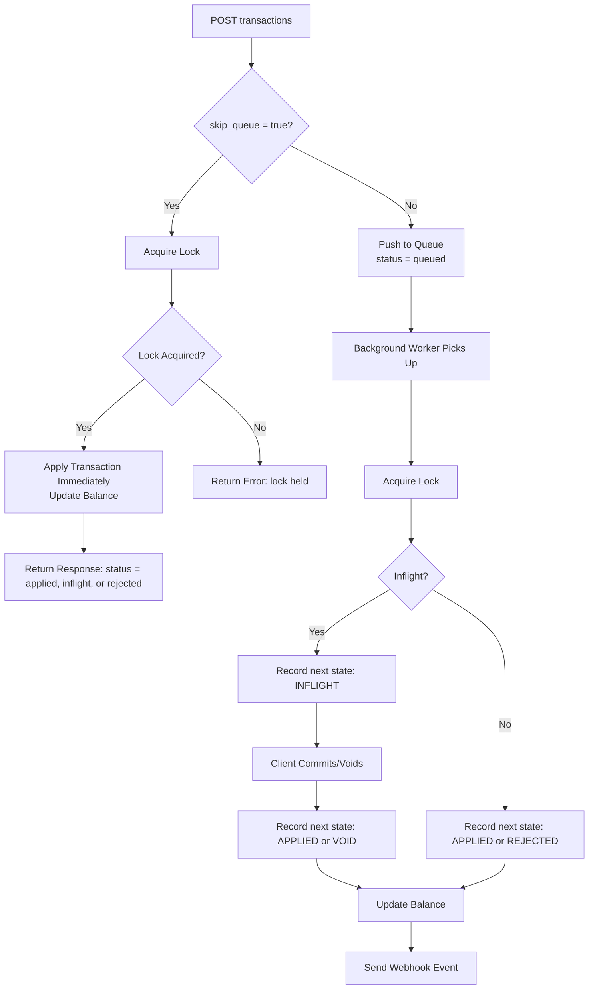

import NeedHelp from "/snippets/need-help.mdx";

## Overview

When building financial systems, the choice between immediate and queue-based transaction processing directly affects the reliability and performance of your application. 

While Blnk supports immediate execution using `skip_queue: true`, this approach becomes unreliable under load. Transactions must acquire distributed locks to maintain balance integrity, and if a lock isn't acquired, the transaction fails without retry.

Queue-based processing provides a more resilient alternative by eliminating lock contention failures experienced when you skip transaction queues. It guarantees transaction completion through built-in retry mechanisms while ensuring data consistency.

---

## How queues work in practice

<Accordion title="Simplified Queue Flow Diagram">



</Accordion>

1. All transactions in Blnk that affect the same balance are routed to the same queue and processed one at a time, in order. This ensures fairness and prevents race conditions.

2. Blnk uses consistent hashing to determine which queue a transaction goes to. This guarantees that two transactions affecting the same balance will always land in the same queue.

3. Transactions are processed in a FIFO (first-in, first-out) order. That means if 1,000 debits hit the same balance in the same second, they will be processed sequentially, in the order received, without any dropped or skipped transactions — unless funds are insufficient at that point in line.

4. Queued transactions return a `transaction_id` immediately. You can track their status using the ID or reference.

5. Inflight transactions also go through the queue. They're just held (instead of applied) until you commit or void them.

---

## Tracking queued transactions

When a queued transaction moves to its next state, Blnk creates a new record that maintains a connection to the original queued transaction. This connection is maintained in two ways:

1. **Parent-Child Relationship:** The new record's `parent_transaction` field stores the original transaction's `transaction_id`. This creates a clear lineage between related transaction records.

2. **Reference Tracking:** To ensure each record remains uniquely identifiable while preserving its relationship to other states, Blnk:
   * Uses the same base reference as the original transaction
   * Appends a `_q` suffix to create a unique reference

For example, if the original queued transaction has:
```json
{
  "transaction_id": "queued_txn_id",
  "status": "QUEUED",
  "reference": "payment_abc"
}
```

The next state's record would have:
```json
{
  "transaction_id": "applied_txn_id",
  "parent_transaction": "queued_txn_id",
  "status": "APPLIED",
  "reference": "payment_abc_q"
}
```

### How to track transaction status

<Steps>
<Step title="Listen for webhook events">
  Blnk sends webhook notifications when transaction status changes. You can listen for these events to track your queued transactions in real-time.
  
  Common webhook events include:
  * `transaction.applied` - Transaction was successfully processed
  * `transaction.rejected` - Transaction was rejected (e.g., insufficient funds, etc.)
  * `transaction.inflight` - Transaction is held in inflight state
</Step>

<Step title="Use the Search API">
  You can also actively query transaction status using the search API with two different methods:
  
  1. **Reference Search:** Query transactions using the original reference. Blnk will return the `INFLIGHT` or `APPLIED` record associated with that reference.
  ```json Request
  {
    "q": "payment_abc",
    "query_by": "reference"
  }
  ```
  
  2. **Parent Transaction Search:** Look up transactions using the original queued `transaction_id` as a parent transaction identifier. This returns the same result as the reference search but uses the parent-child relationship instead of the reference string.
  ```json Request
  {
    "q": "txn_123",
    "query_by": "parent_transaction"
  }
  ```
</Step>
</Steps>

---

## Queue vs skip_queue

### When to use queues (default behavior)

Use queue-based processing when:

- **High-traffic balances**: Multiple users or processes target the same balance simultaneously
- **Payment processing**: Customer-initiated payments, especially for popular accounts
- **Batch operations**: Processing multiple transactions that might affect the same balances
- **Reliability is critical**: You need guaranteed transaction completion without manual retry logic

### When to skip queues

Use immediate processing only for:

- **Low-traffic scenarios**: Balances that rarely receive concurrent transactions
- **Real-time requirements**: Interactive sessions requiring immediate feedback
- **Single-user operations**: Transactions initiated by one user at a time
- **Testing and development**: Non-production environments with controlled load

<Tip>
If you're experiencing `Failed to acquire lock` errors with `skip_queue: true`, switch to queue-based processing. Queues eliminate lock contention by serializing transactions for the same balance, ensuring all transactions eventually succeed without manual intervention.
</Tip>

---

## Handling high-traffic balances

When dealing with "hot balances" that receive high traffic, we recommend three ways to handle lock contention:

### Option 1: Use the queue (recommended)

Don't skip the queue. The queue is specifically built to handle [concurrency](/guides/concurrency) properly. You can:

- **Listen for webhooks or events** to trigger the next steps in your flow;
- **Use a poller** that checks for applied or rejected transactions.

### Option 2: Handle concurrency on your end

If you want to use `skip_queue: true`, you must handle concurrency yourself. For balances known to receive high traffic, manage how transactions are sent to avoid lock errors with immediate processing. 

Implement sequential processing to ensure that transactions are sent one after the other, not all at once.

### Option 3: Use intermediary balances

Introduce an intermediary balance to reduce load and improve response times. 

**Instead of:** `Customer balance → GL Balance`

**Use:** `Customer balance → Customer hold balance → GL Balance`

This approach works by:

1. **Customer balance → Customer hold balance** (can use `skip_queue: true` for immediate processing)
   * The customer hold balance can safely use `skip_queue` because it only receives transactions from that specific customer.
   * It acts like a mini balance that represents the customer's interaction with the GL balance, but scoped only to that customer to avoid lock contention.
   * Each customer gets their own hold balance, eliminating competition for locks.

2. **Customer hold balance → GL balance** (use queue, don't skip)
   * Internally, funds can be bulk settled into the GL balance using the queue system.
   * This moves pressure away from the GL balance and provides you with more flexibility in processing high-traffic transactions.

---

<NeedHelp />