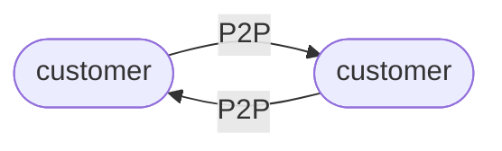

import NeedHelp from "/snippets/need-help.mdx";

## Overview

A money movement map is a simple visual representation of how funds flow within your system. To design and implement your [ledger architecture](/ledgers/architecture) effectively with Blnk, you must first define how you want money to move through your system.

<Warning>
  This is not an exercise for developers alone — ledger design is serious business that needs consensus from several key stakeholders who rely on it for their own operations and workflows.
</Warning>

---

## Why are Maps important?

Your map acts as your engineering team’s blueprint for implementing your Ledger, ensuring data consistency and accuracy. 

A well-designed map transforms your ledger into a reliable source of truth, empowering teams across your organization—whether in finance, operations, or strategy—to confidently rely on its data for informed decisions, trend analysis, and compliance.

This foundational clarity allows you to leverage the ledger for diverse purposes, including reporting, reconciliation, and business intelligence. Additionally, it can support critical accounting tasks such as generating balance sheets, profit and loss statements, and tracking the general ledger.

---

## Key design principles

There are two key principles to keep in mind when designing your map:

1. **Double-entry principle:** Every movement of money always has two sides—a source where the money is deducted and a destination where it is credited. Source and destination are represented with [balances](/balances/introduction) in Blnk.

2. **Clarity of flow (Uni-directional principle):** Money should always be represented as moving in a clear, single direction—from source to destination—without ambiguity or circular references. This makes the map easy to interpret and ensures logical consistency.

---

## Designing our map

Maps are typically designed with:

1. **Nodes (or circles):**  These represent entities or balances (e.g., accounts, wallets, or financial instruments where funds are stored).

2. **Edges (or arrows):** These represent the connections or money movement between nodes (e.g., transactions, transfers, or flows of funds).

<Tip>
  The best way to build your map is to start by describing how your system works step-by-step.
</Tip>

Let’s say you run a wallet app. Your customers can send and receive money with each other (P2P) right in the app. Our map starts like this:



On top of that, they can deposit funds to top up their wallets or make payouts to accounts outside your system. For deposits, money come from outside, and vice versa for payouts. We're going to use [an internal balance](/balances/internal-balances) to represent "outside" in our map.

To simplify our map, your customers are going to be represented by one node. Now our map looks like this:

```mermaid
flowchart LR
  payin([@pay-in])
  customer([customer])
  payout([@pay-out])
  payin -- deposit --> customer
  customer -- payout/withdrawal --> payout
```

`@pay-in` represents "outside" for deposits, and `@pay-out` represents "outside" for payouts.

Let's add some more details. 

When a customer deposits money in their wallet, your pay-in provider charges you a processing fee, but you don't pass it to the customer. You pay this fee from your company account.

```mermaid
flowchart LR
  payin([@pay-in])
  customer([customer])
  payout([@pay-out])
  fees([@fees])
  payin -- deposit\n(full amount) --> customer
  customer -- payout/withdrawal--> payout
  payin -- payin provider fee --> fees
```

When a customer initiates a payout or withdrawal, you charge a fee and your payout provider charges you a processing fee as well. You pass these fees to the customer.

You also charge no fees when they transact with other wallets in your app.

Now your map looks like this:

```mermaid
flowchart LR
  payin([@pay-in])
  customer([customer])
  payout([@pay-out])
  revenue([@revenue])
  fees([@fees])
  payin -- deposit\n(full amount) --> customer
  customer -- our fee --> revenue
  customer -- withdrawal/transfer\n(amount + provider fee) --> payout
  payout -- payout provider fee --> fees
  payin -- payin provider fee --> fees
```

Note that:

1. The pay-in provider fee paid from your company account doesn't create a dedicated node for the account. Instead, we track this fee as money coming from “outside” directly into the `@fees` balance. This keeps the map focused while still accounting for the expense.

2. Only nodes essential to the flow of funds in the system are included in this map. This ensures the design remains simple, clear, and easy to manage.

3. `@pay-in` and `@pay-out` only represents source and destination when money is coming into and going out of our system respectively. 

---

## Our map in summary

1. The deposit flow:
   - Pay-in provider credits the full amount to customer's wallet.
   - Pay-in provider charges you a fee (shown as flow to `@fees`).
   - Pay-in provider periodically settles to your settlement account manually.

2. The payout flow:
   - Customer initiates a payout with amount plus all fees.
   - Your fee goes to revenue.
   - Provider's fee goes to `@fees`.
   - The actual payout amount is debited from your payout account.

---

## Our ledger architecture

Using the money movement map above, our Blnk Ledger will look like this:

| Ledger | Balances |
| :--- | :--- |
|General Ledger | `@pay-in` <br/> `@pay-out` <br/> `@fees` <br/> `@revenue` |
| Customer Wallets Ledger | `customer-wallet-1` <br/> `customer-wallet-2` <br/> `customer-wallet-3` <br/> `customer-wallet-n` |

The map also enables other teams in our wallet product do the following:

1. Match individual deposits between `@pay-in` and customer balances.
2. Match individual payouts between customer balances and `@pay-out`.
3. Auto-detect mismatches in transaction amounts between provider statements and customer balances.

---

## Build your own Map

Every financial product has unique characteristics that shape how money moves in its system. 

There's no universal approach to building a money movement map - the ideal structure depends on your specific product features, operational processes, and team requirements.

Need help with your money movement map? We can help you build or review your map. [Send us an email](mailto:support@blnkfinance.com) or [drop a message on Discord](https://discord.gg/7WNv94zPpx).

---

<NeedHelp/>