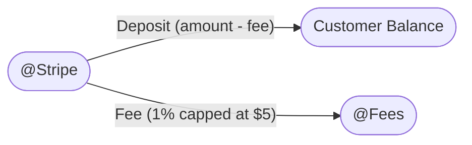
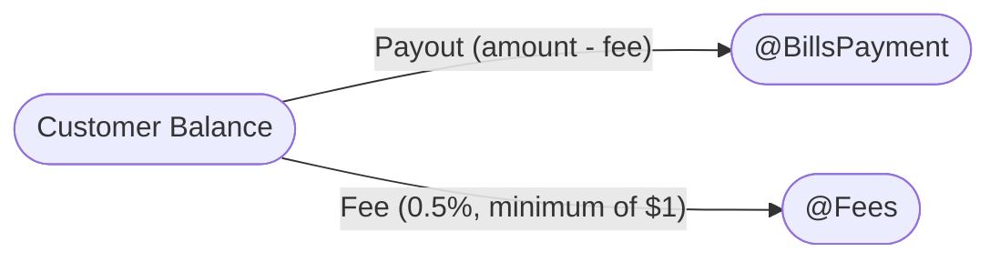

import RequestTutorial from "/snippets/request-tutorial.mdx"

## Overview

In this tutorial, you’ll learn how to implement deposits and payouts using the Blnk Ledger. You’ll explore and apply a variety of workflows to handle deposits and payouts seamlessly. This includes:

1. Understanding how to set up your ledger for effective tracking of deposits and payouts in your system.
2. Designing flexible workflows to accommodate various scenarios.
3. Ensuring reliable and accurate transaction processing for your users.

For this tutorial, we’ll use the [Blnk TypeScript SDK](/sdks/typescript/introduction) for the implementation. If you prefer, you can also refer to the [API reference](/reference/create-ledger) for details on the available endpoints.

---

## Prerequisites

Before starting, ensure you have:

1. A running Blnk server instance (e.g. at `http://localhost:5001`).
2. An API key for Blnk (replace `YOUR_API_KEY` in the code examples). Required for authenticated requests.
3. The [Blnk CLI](/blnk-cli/install) installed or a connected [Blnk Cloud](https://cloud.blnkfinance.com) workspace to view your ledger data.

To prepare for the rest of this tutorial, read our [Building a Wallet with Blnk](/tutorials/quick-start/wallet-management) tutorial if you haven’t already.

This resource will walk you through creating ledger balances for accounts in Blnk, which are essential for implementing deposits, withdrawals, and other financial operations covered later in this tutorial.

---

## Handling deposits

When using Blnk to manage deposits, you can track the sources of your deposits—such as Stripe, Acme Bank, or others—directly in your ledger, enabling more detailed and accurate reporting.

As illustrated in the map below, each source can be assigned to an internal balance, which will be reflected as the value of the `source` field in your transaction request. Fees (1% of the deposit amount, capped at $5) are deducted and tracked separately.



From our map, we can verify:

* The source of the deposit, for example, @AcmeBank if it originates from Acme Bank.
* That the customer receives funds after the fees have been dededucted.
* The deposit fees are tracked using the `@Fees` balance.

### Deposits with fee processing

When recording a deposit with fee processing, we’ll use the [Multiple Destinations](/transactions/multiple-destinations) feature to distribute the incoming funds between the customer’s balance and the fees balance.

We’ll also apply `inflight` to validate the deposits against predefined business rules before finalizing the transaction.

```javascript
async function recordDeposit(sourceId, customerBalanceId, amount, reference, stripePaymentId) {
  const blnk = await getBlnkInstance();
  
  // Calculate fee (1% capped at $5)
  const feePercentage = 0.01;
  const feeCap = 5;
  const calculatedFee = Math.min(amount * feePercentage, feeCap);
  const customerAmount = amount - calculatedFee;
  
  // Record the deposit with multiple destinations
  const transaction = await blnk.Transactions.create({
    amount: amount,                  // Total amount being deposited
    precision: 100,                 
    reference: reference,          
    currency: "USD",
    source: sourceId,               
    inflight: true,                  // Hold for verification
    destinations: [
      {
        identifier: customerBalanceId,
        distribution: `${customerAmount}`,                
        narration: "Deposit to your account"
      },
      {
        identifier: "@Fees",           
        distribution: `${calculatedFee}`, 
        narration: "Processing fee"
      }
    ],
    meta_data: {
      fee_amount: calculatedFee,
      stripe_payment_id: stripePaymentId
    },
    skip_queue: true                // Process immediately, bypassing queue
  });
  
  console.log(`Deposit recorded with ID: ${transaction.data.transaction_id}`);
  return transaction.data;
}
```

<Tip>
  When you apply `inflight` to a multiple destinations transaction, all associated transactions—distributing funds to both destinations—are also placed in an `inflight` state until the commit or void is executed.
</Tip>

### Verifying deposits based on business rules

Next, we’ll develop functions to process deposits according to the following business rules. In this tutorial, we’ll implement checks for two rules:

1. If the balance is blocked or frozen, the deposit should be voided.

2. If the deposit amount exceeds 1 million USD, it should remain in an `inflight` state, and a notification should be sent for further investigation.

#### Rule 1: Check if balance is blocked or frozen

```javascript
async function processDepositBasedOnRules(transactionId) {
  
  // Retrieve transaction details
  const transaction = await blnk.Transactions.retrieve(transactionId);
  
  // Extract destination balance IDs (assuming the first destination is the customer)
  const destinations = transaction.data.destinations || [];
  
  const customerBalanceId = destinations[0].identifier;
  
  // Retrieve balance details
  const balance = await blnk.LedgerBalances.retrieve(customerBalanceId);
  const meta = balance.data.meta_data || {};
  
  // Check if balance is frozen or blocked
  if (meta.status === "frozen" || meta.status === "blocked") {
    try {
        // First update metadata with the reason
        const response = await blnk.Transactions.updateMetadata(transactionId, {
            meta_data: {
                void_reason: `Account ${meta.status}`,
            }
        });
        if (response.success) {
            // Then void the transaction
            const void_result = await blnk.Transactions.inflight.void(transactionId);
            console.log(`Transaction ${transactionId} voided: account ${meta.status}`);
            return void_result.data;
        }
    } catch (error) {
        console.error("Error occurred:", error);
    }
  }
  
  // If balance is active, proceed with amount check
  return await processDepositByAmount(transactionId);
}
```

#### Rule 2: Check amount rule

```javascript
async function processDepositByAmount(transactionId) {

  // Retrieve transaction details
  const transaction = await blnk.Transactions.retrieve(transactionId);
  const amount = transaction.data.precise_amount;
  
  // Check if amount is less than 1,000,000.00 USD (with precision 100, so 100000000 = $1M)
  if (amount < 100000000) {
    // Less than $1M - commit the transaction
    const commit = await blnk.Transactions.inflight.commit(transactionId);
    console.log(`Transaction ${transactionId} committed: amount below threshold`);
    return commit.data;
  } else {
    // $1M or more - flag for investigation using updateMetadata
    const response = await blnk.Transactions.updateMetadata(transactionId, {
      "meta_data": {
        "investigation_required": true,
        "investigation_reason": "Large deposit amount",
        "flagged_at": new Date().toISOString()
      }
    });
    
    // Here you would trigger a notification via Hooks
    await triggerLargeDepositHook(transactionId, amount);
    
    console.log(`Transaction ${transactionId} flagged for investigation: large amount`);
    return response.data;
  }
}
```

Read more: [How to Use Hooks to Trigger Notifications →](/hooks/overview)

### Putting it all together

```javascript
async function handleStripeDeposit(stripePaymentId, customerBalanceId, amount) {
  const blnk = await getBlnkInstance();
  
  // Step 1: Record the deposit with fee processing
  const reference = `stripe_${stripePaymentId}`;
  const depositData = await recordDeposit(
    "@Stripe", 
    customerBalanceId, 
    amount, 
    reference,
    stripePaymentId
  );
  
  // Step 2: Process the deposit based on business rules
  const result = await processDepositBasedOnRules(depositData.transaction_id);
  
  return {
    message: `Deposit processed with status: ${result.status}`
  };
}
```

### Refunding deposits

To process refunds in your ledger and reverse a deposit:

```javascript
async function refundDeposit(transactionId, reason = 'Customer requested refund') {
  const blnk = await getBlnkInstance();
  
  // Process the refund
  const refund = await blnk.Transactions.refund(transactionId);
  
  // Update metadata on the refund transaction
  await blnk.Transactions.updateMetadata(refund.data.refund_id, {
    meta_data: {
      refund_reason: reason,
    }
  });
  
  console.log(`Deposit refunded: ${refund.data.refund_id}`);
  return refund.data;
}
```

---

## Handling payouts

Payouts function similarly to deposits but in reverse. 

The `Customer Balance` serves as the source, while the `Payout Destination` and `@Fees` act as the destinations. Include `@Fees` if the customer incurs fees for payment processing.



From our map, we can verify:

* The destination of the withdrawal.
* That the customer receives funds after the fees have been deducted.
* The deposit fees are tracked using the `@Fees` balance.

### Path 1: Successful payouts

Here, the payout was successfully completed by your payout provider:

```javascript
// Initiate a payout with inflight
async function initiatePayout(customerBalanceId, billsAmount, reference) {
  const blnk = await getBlnkInstance();

  // Calculate fee (0.5% with $1 minimum)
  const feePercentage = 0.005;
  const minFee = 1;
  const calculatedFee = Math.max(billsAmount * feePercentage, minFee);
  const totalAmount = billsAmount + calculatedFee;
  
  const payout = await blnk.Transactions.create({
    amount: totalAmount,
    precision: 100,
    reference: reference,
    description: "Payout for bills",
    currency: "USD",
    source: customerBalanceId,
    destinations: [
      {
        identifier: "@BillsPayment",
        distribution: `${billsAmount}`,
        narration: "Payout for bills"
      },
      {
        identifier: "@Fees",
        distribution: `${calculatedFee}`,
        narration: "Payout processing fee"
      }
    ],
    inflight: true,
    inflight_expiry_date: getExpiryDate(24), // Expires if no response is gotten in 24 hours
    meta_data: {
      payout_status: "pending",
      fee_amount: calculatedFee
    },
    skip_queue: true                         // Process immediately, bypassing queue
  });
  
  console.log(`Payout initiated: ${payout.data.transaction_id}`);
  return payout.data;
}

// Generate expiry date (hours from now)
function getExpiryDate(hours) {
  const date = new Date();
  date.setHours(date.getHours() + hours);
  return date.toISOString();
}
```

#### Commit based on feedback from payout provider

```javascript
// Webhook handler for payment processor notifications
async function handlePaymentWebhook(webhookBody) {
  const { 
    event_type, 
    payout_id, 
    status, 
    transaction_reference 
  } = webhookBody;
  
  if (event_type === 'payment.success') {

    // Find the transaction by reference
    const searchResult = await blnk.Search.search({
      q: transaction_reference,
      query_by: "reference",
      filter_by: "status:=INFLIGHT"
    }, "transactions");

    // Get the parent transaction (transaction_id connecting both transactions together)
    const transaction = searchResult.data.hits[0].document;
    const transactionId = transaction.parent_transaction;

    // Update metadata with details from provider
    await blnk.Transactions.updateMetadata(transactionId, {
      meta_data: {
        payout_status: "confirmed",
        provider_payout_id: payout_id,
        confirmation_time: new Date().toISOString()
      }
    });

    // Commit the transaction
    const commit = await blnk.Transactions.inflight.commit(transactionId);
    console.log(`Payout confirmed and committed: ${transactionId}`);
    return { 
      processed: true, 
      transaction_id: transactionId 
    };
  }
}
```

#### How multiple destinations work

When using [Multiple Destinations](/transactions/multiple-destinations) in a transaction (like in our tutorial), Blnk automatically generates a separate transaction record for each distribution. These individual records are linked together with the `parent_transaction` parameter. 

This structure organizes and connects all parts of a multi-destination transaction efficiently.

A standout feature of this system is how actions on the `parent_transaction` affect the entire group:

* Committing the `parent_transaction` automatically commits all associated distributions, confirming the full distribution.
* Voiding the `parent_transaction` automatically voids all distributions, canceling the entire distribution in one step.

This unified approach simplifies managing complex transactions involving multiple recipients.

### Path 2: Failed payouts

The payout is pending, but a failure message was received from the provider, resulting in the transaction being voided:

```javascript
async function handlePaymentWebhook(webhookBody) {
  const { 
    event_type, 
    payout_id, 
    status, 
    transaction_reference 
  } = webhookBody;
  
  if (event_type === 'payment.failed') {

    // Find the transaction by reference
    const searchResult = await blnk.Search.search({
      q: transaction_reference,
      query_by: "reference",
      filter_by: "status:=INFLIGHT"
    }, "transactions");

    // Get the parent transaction (transaction_id connecting both transactions together)
    const transaction = searchResult.data.hits[0].document;
    const transactionId = transaction.parent_transaction;

    // Update metadata with details from provider
    await blnk.Transactions.updateMetadata(transactionId, {
      meta_data: {
        payout_status: "failed",
        provider_payout_id: payout_id,
        confirmation_time: new Date().toISOString()
      }
    });

    // Void the transaction
    const void = await blnk.Transactions.inflight.void(transactionId);
    console.log(`Payout cancelled: ${transactionId}`);
    return { 
      processed: true, 
      transaction_id: transactionId 
    };
  }
}
```

### Path 2: Successful payout but reversed

The payout was initially successful, with confirmation received from the provider, but the funds were reversed by the provider due to an inability to settle the transaction:

```javascript
async function refundPayout(transactionId, reason = "Can't complete payout") {
  const blnk = await getBlnkInstance();
  
  // Process the refund
  const refund = await blnk.Transactions.refund(transactionId);
  
  // Update metadata on the refund transaction
  await blnk.Transactions.updateMetadata(refund.data.refund_id, {
    meta_data: {
      refund_reason: reason,
    }
  });
  
  console.log(`Payout refunded: ${refund.data.refund_id}`);
  return refund.data;
}
```

---

## Conclusion

You now have a basic deposits and payouts system powered by Blnk Ledger. It efficiently processes transactions while ensuring accurate records.

The system is flexible and can be expanded with features like:

* Automated handling of failed transactions
* Custom withdrawal limits and approval workflows
* Support for multiple funding sources
* Real-time transaction monitoring and alerts

With Blnk’s transaction system, you can track and manage all money movements, building a solid foundation for your financial operations.

---

<RequestTutorial />