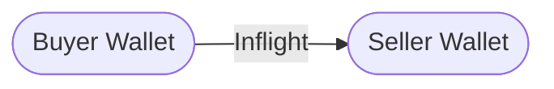

import RequestTutorial from "/snippets/request-tutorial.mdx"

## Overview

In this tutorial, we’ll build a simple escrow payment workflow using Blnk’s inflight transaction feature. Here's what we'll do:

1. Initiate an escrow transaction.
2. Verify that all conditions have been met.
3. Update the transaction based on the conditions.
4. Handle alternative use cases cases like partial fulfilment.

For this tutorial, we’ll use the [Blnk TypeScript SDK](/sdks/typescript/introduction) for the implementation. If you prefer, you can also refer to the [API reference](/reference/create-ledger) for details on the available endpoints.

---

## Designing your map

Before writing code, it's crucial to design a [money movement map](/ledgers/money-movement-map) that outlines how money moves in your system. This serves as the blueprint for your implementation.

For our escrow payments workflow, here's our map:



Read more: [Inflight transactions →](/transactions/inflight)

This map shows three key aspects of the escrow fund flow:

* `Buyer` initiates transaction to `Seller`.
* Transaction is held inflight until the escrow conditions are met or not.
* Transaction is completed or discarded depending on the inflight status, and the balances get updated.

---

## Set up your implementation

Based on our map, we'll implement the following steps:

1. Initiate a transaction with inflight between the `Buyer Wallet` and the `Seller Wallet`.
2. Update the status of our inflight transaction.
    * Commit if the escrow payment is successful.
    * Void if the escrow payment failed.

---

## Prerequisites

Before starting, ensure you have:

1. A running Blnk server instance (e.g. at `http://localhost:5001`).
2. An API key for Blnk (replace `YOUR_API_KEY` in the code examples). Required for authenticated requests.
3. The [Blnk CLI](/blnk-cli/install) installed or a connected [Blnk Cloud](https://cloud.blnkfinance.com) workspace to view your ledger data.
4. Balances created for the buyer and seller wallets in your Blnk Ledger. Learn how: [Building a Wallet Management System with Blnk →](/tutorials/quick-start/wallet-management).
5. Funded the buyer wallet balance in ledger.

---

## Initiate escrow transaction

[Create a transaction](/transactions/introduction#recording-a-transaction) with `inflight` enabled.

<CodeGroup>
```javascript TypeScript {13}
async function createEscrowTransaction(buyerWalletId, sellerWalletId, amount, uniqueReference, description) {
  const blnk = await getBlnkInstance();
  const { Transactions } = blnk;
  
  const escrow = await Transactions.create({
    amount: amount,
    precision: 100,
    reference: uniqueReference,
    description: description || "Escrow payment",
    currency: "USD",
    source: buyerBalanceId,
    destination: sellerBalanceId,
    inflight: true, // Holds funds in escrow
    meta_data: {
      transaction_type: "escrow",
      escrow_status: "pending",
      buyer_confirmation: false,
      seller_confirmation: false,
    }
  });
  
  console.log("Escrow transaction created:", escrow.data.transaction_id);
  return escrow.data.transaction_id;
}
```
```bash cURL {9-10}
curl -X POST "http://localhost:5001/transactions" \
  -H "Content-Type: application/json" \
  -d '{
    "amount": 100.43,
    "precision": 100,
    "reference": "escrow_ref_12345",
    "description": "Escrow payment",
    "currency": "USD",
    "source": "<buyer_balance_id>",
    "destination": "<seller_balance_id>",
    "inflight": true,
    "meta_data": {
      "transaction_type": "escrow",
      "escrow_status": "pending",
      "buyer_confirmation": false,
      "seller_confirmation": false
    }
  }'
```
</CodeGroup>

<Note>
  When `inflight` is enabled, the transaction remains pending, ensuring that neither the source nor the destination balance is affected until the specified conditions are met.
</Note>

---

## Path 1: Successful escrow payment

For a successful escrow payment, commit the inflight transaction to apply it to the buyer and seller balances:

<CodeGroup>
```javascript TypeScript
async function commitInflightTransaction(transactionId) {
  const { Transactions } = blnk;
  
  try {
    const committedTransaction = await Transactions.updateInflight(
      transactionId,
      {
        status: "commit"
      }
    );
    
    console.log(`Transaction ${transactionId} successfully committed`);
    return committedTransaction.data;
  } catch (error) {
    console.error(`Error committing transaction ${transactionId}:`, error);
    throw error;
  }
}
```
```bash cURL
curl --location 'http://localhost:5001/transactions/inflight/<inflight-transaction-id>' \
--header 'Content-Type: application/json' \
--header 'Authorization: Bearer YOUR_API_KEY' \
--data '{
    "status": "commit"
}'
```
</CodeGroup>

---

## Path 2: Failed escrow payment

If the escrow failed, void the inflight transaction instead:

<CodeGroup>
```javascript TypeScript
async function voidInflightTransaction(transactionId) {
  const { Transactions } = blnk;
  
  try {
    const voidedTransaction = await Transactions.updateInflight(
      transactionId,
      {
        status: "void"
      }
    );
    
    console.log(`Transaction ${transactionId} successfully voided`);
    return voidedTransaction.data;
  } catch (error) {
    console.error(`Error voiding transaction ${transactionId}:`, error);
    throw error;
  }
}
```
```bash cURL
curl --location 'http://localhost:5001/transactions/inflight/<inflight-transaction-id>' \
--header 'Content-Type: application/json' \
--header 'Authorization: Bearer YOUR_API_KEY' \
--data '{
    "status": "void"
}'
```
</CodeGroup>

---

## Path 3: Partial escrow payment

Escrow payments can also be fulfilled in bits, meaning you can complete part of the total amount over time, e.g., for a \$100 transaction, you can commit \$30, then \$40, then the remaining \$30 later.

<CodeGroup>
```javascript TypeScript
async function commitInflightTransaction(transactionId, partialAmount) {
  const { Transactions } = blnk;
  
  try {
    const committedTransaction = await Transactions.updateInflight(
      transactionId,
      {
        status: "commit",
        amount: partialAmount
      }
    );
    
    console.log(`Transaction ${transactionId} successfully committed`);
    return committedTransaction.data;
  } catch (error) {
    console.error(`Error committing transaction ${transactionId}:`, error);
    throw error;
  }
}
```
```bash cURL
curl --location 'http://localhost:5001/transactions/inflight/<inflight-transaction-id>' \
--header 'Content-Type: application/json' \
--header 'Authorization: Bearer YOUR_API_KEY' \
--data '{
    "status": "commit",
    "amount": 30
}'
```
</CodeGroup>

<Tip>
  You can also make multiple partial commits and void the remaining inflight amount if needed.
</Tip>

---

## Conclusion

This tutorial demonstrated how to build a secure escrow payment system using Blnk’s inflight feature, enabling safe transactions for buyers and sellers. The system includes initiating escrows, tracking confirmations, releasing funds upon mutual agreement, and handling cancellations.

With Blnk's flexible architecture, you can easily adapt this escrow system to various business models, including from marketplace transactions and freelancer payments to real estate deals and complex business contracts.

<Card title="Inflight transactions" icon="plane" href="/transactions/inflight">
  Learn everything about inflight (plus best practices)
</Card>

---

<RequestTutorial />