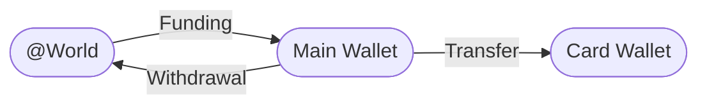

import RequestTutorial from "/snippets/request-tutorial.mdx"

## Overview

This tutorial will guide you through implementing a simple wallet management system using the Blnk Ledger. By the end, you'll have built a system that can:

1. Create customer wallets.
2. Link wallets to customer identities.
3. Support deposits and withdrawals from wallets.
4. Create purpose-specific wallets (e.g. card balances).
5. Enable transfers between wallets.

For this tutorial, we’ll use the [Blnk TypeScript SDK](/sdks/typescript/introduction) for the implementation. If you prefer, you can also refer to the [API reference](/reference/create-ledger) for details on the available endpoints.

---

## Designing your map

Before writing code, it's crucial to design a [money movement map](/ledgers/money-movement-map) that outlines how money moves in your system. This serves as the blueprint for your implementation.

For our wallet management system, here's how funds will flow:



This map shows three key components:

* `@World`: Represents external funding sources and withdrawal destinations.
* `Main Wallet`: The customer's primary wallet for deposits and withdrawals.
* `Card Wallet`: A second wallet for card-related transactions.

From our map, we can verify that: 

* Customers can deposit money from external sources to their main wallet.
* Customers can withdraw money from their main wallet to external destinations.
* Customers can transfer money from their main wallet to their card wallet.

---

## Set up your implementation

Based on our map, we'll implement the following steps:

1. Create a customer ledger to organise all customer wallets.
2. Create customer identity for storing user information.
3. Create a main wallet and link it to the identity.
4. Implement deposit functionality.
5. Implement withdrawal functionality.
6. Create a card wallet and link it to the same identity.
7. Fund the card wallet from the main wallet.

---

## Before you start

1. Ensure Blnk Core is [installed](/home/install) and deployed (locally or on a [cloud infrastructure](/advanced/deployment))
2. Configure your settings. See: [Configuration file →](/advanced/configuration)
3. Start the Blnk server using:
    ```
    docker compose up
    ```

---

## Create customer ledger

First, we need to initialise Blnk and [create a ledger](/ledgers/introduction) to organise all our customer wallets.

```javascript Initialising Blnk
const { BlnkInit } = require('@blnkfinance/blnk-typescript');

let blnkInstance = null;

async function getBlnkInstance() {
  if (!blnkInstance) {
    blnkInstance = await BlnkInit('', { baseUrl: 'http://localhost:5001' });
  }
  return blnkInstance;
}
```
```javascript Create ledger
async function createCustomerLedger() {
  const blnk = await getBlnkInstance();
  const { Ledgers } = blnk;
  
  const customerLedger = await Ledgers.create({
    name: "Customer Wallets Ledger",
    meta_data: {
      description: "Ledger for managing customer wallets",
      application: "Wallet Management System"
    }
  });
  
  console.log("Customer Ledger created:", customerLedger.data.ledger_id);
  return customerLedger.data.ledger_id;
}
```

<Warning>
  Always save the `ledger_id` in your database. You'll use this ID to create balances for the customer wallets.
</Warning>

---

## Create customer identity

Create your customer profiles with [identities](/identities/introduction):

```javascript Create identity
async function createCustomerIdentity(customerData) {
  const blnk = await getBlnkInstance();
  const { Identities } = blnk;
  
  const identity = await Identities.create({
    identity_type: "individual",
    first_name: customerData.firstName,
    last_name: customerData.lastName,
    email_address: customerData.email,
    phone_number: customerData.phone,
    meta_data: {
      customer_id: customerData.customerId,
      registration_date: new Date().toISOString()
    }
  });
  
  console.log("Customer Identity created:", identity.data.identity_id);
  return identity.data.identity_id;
}
```

<Warning>
  Always save the `identity_id` in your database. You'll use this ID to link balances to this identity or query all balances owned by this identity.
</Warning>

---

## Create main wallet

[Create a balance](/balances/introduction) to represent the customer main wallet and link to the customer identity:

```javascript Create main wallet
async function createMainWallet(ledgerId, identityId, currency) {
  const blnk = await getBlnkInstance();
  const { LedgerBalances } = blnk;
  
  const mainWallet = await LedgerBalances.create({
    ledger_id: ledgerId,
    identity_id: identityId,
    currency: currency,
    meta_data: {
      wallet_type: "main",
      purpose: "general",
      status: "active"
    }
  });
  
  console.log("Main Wallet created:", mainWallet.data.balance_id);
  return mainWallet.data.balance_id;
}
```

<Warning>
  Always store the `balance_id` in your database and associate it with the customer. You'll use this ID for all future transactions involving this wallet.
</Warning>

---

## Funding the main wallet

Use an [internal balance](/balances/internal-balances) to represent external deposit sources—such as bank accounts, cards, and other funding methods—responsible for funding a customer's wallet:

```javascript Wallet funding
async function depositToWallet(customerBalanceID, amount, uniqueReference, description) {
  const blnk = await getBlnkInstance();
  const { Transactions } = blnk;
  
  const deposit = await Transactions.create({
    amount: amount,
    precision: 100,
    reference: uniqueReference,
    description: description || "Deposit to wallet",
    currency: "USD",
    source: "@WorldUSD",
    destination: customerBalanceID,
    allow_overdraft: true, // Enable for the external source
    meta_data: {
      transaction_type: "deposit",
      channel: "bank_transfer"
    }
  });
  
  console.log("Deposit transaction created:", deposit.data.transaction_id);
  return deposit.data.transaction_id;
}
```

<Note>
  Setting `allow_overdraft` to `true` enables the transaction to proceed even if the source balance lacks sufficient funds.
</Note>

---

## Withdrawals from the main wallet

You can use the same internal balance to represent external withdrawal destinations to ensure it is balances out your ledger, or you can allocate a separate internal balance specifically for withdrawals.

```javascript Wallet withdrawals
async function withdrawFromWallet(customerBalanceID, amount, uniqueReference, description) {
  const blnk = await getBlnkInstance();
  const { Transactions, LedgerBalances } = blnk;
  
  const withdrawal = await Transactions.create({
    amount: amount,
    precision: 100,
    reference: uniqueReference,
    description: description || "Withdrawal from wallet",
    currency: "USD",
    source: customerBalanceID,
    destination: "@WorldUSD",
    meta_data: {
      transaction_type: "withdrawal",
      channel: "bank_transfer"
    }
  });
  
  console.log("Withdrawal transaction created:", withdrawal.data.transaction_id);
  return withdrawal.data.transaction_id;
}
```

---

## Creating a card balance

To create a card balance and link it to the customer:

```javascript Create card wallet
async function createCardWallet(ledgerId, identityId, currency) {
  const blnk = await getBlnkInstance();
  const { LedgerBalances } = blnk;
  
  const cardWallet = await LedgerBalances.create({
    ledger_id: ledgerId,
    identity_id: identityId,
    currency: currency,
    meta_data: {
      wallet_type: "card",
      purpose: "card_payments",
      status: "active",
      card_details: {
        masked_number: "xxxx-xxxx-xxxx-1234",
        expiry: "12/25",
        type: "virtual"
      }
    }
  });
  
  console.log("Card Wallet created:", cardWallet.data.balance_id);
  return cardWallet.data.balance_id;
}
```

---

## Funding the card from main wallet

Record a transaction between both balances to fund your card balance:

```javascript Card funding
async function transferToCardWallet(mainBalanceID, cardBalanceID, amount, uniqueReference, description) {
  const blnk = await getBlnkInstance();
  const { Transactions, LedgerBalances } = blnk;
  
  const transfer = await Transactions.create({
    amount: amount,
    precision: 100,
    reference: uniqueReference,
    description: description || "Transfer to card wallet",
    currency: "USD",
    source: mainBalanceID,
    destination: cardBalanceID,
    meta_data: {
      transaction_type: "internal_transfer",
      purpose: "fund_card"
    }
  });
  
  console.log("Transfer transaction created:", transfer.data.transaction_id);
  return transfer.data.transaction_id;
}
```

---

## Conclusion

You should now have a fully functional and scalable wallet management system. 

As your application grows, you can expand its capabilities with features like [transaction history](/search/overview), [scheduled transfers](/transactions/scheduling), [balance monitors](/balances/balance-monitoring), and [notifications](/hooks/overview) to enhance performance and user experience.

---

<RequestTutorial />