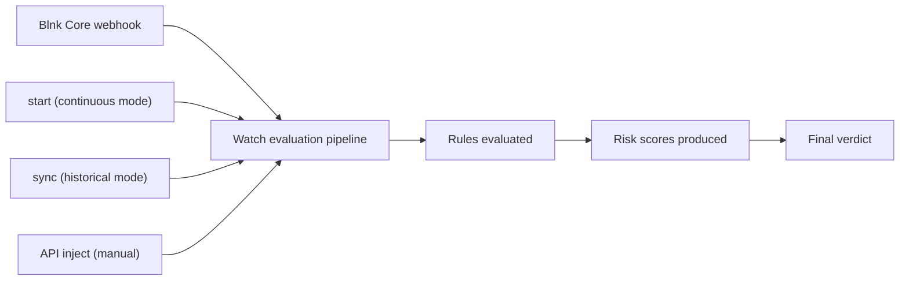

## Overview

Every transaction in your system carries signals that indicate risk. A payment might exceed a limit, a payout might violate a policy, or a pattern of activity might suggest abuse.

Blnk Watch [evaluates those signals](#evaluation-workflow) using [rules you define](#rule-evaluation) and returns a [risk verdict](#final-verdict) for each transaction. It runs alongside your Blnk Ledger and allows you to apply checks before, during, or after a transaction is processed.

When a transaction occurs, Watch evaluates it against your rules and produces a verdict such as `allow`, `approve`, `alert`, `review`, `deny`, or `block`.

With Watch, it becomes easier to enforce controls like:

1. Fraud and compliance checks  
2. Transaction limits  
3. Velocity monitoring  
4. Payout or withdrawal checks  
5. Promo abuse prevention  
6. Operational guardrails

---

## Evaluation workflow



Once a transaction enters Watch, it follows the same lifecycle every time:

1. It checks the transaction against the active rules.  
2. Multiple rules can trigger for the same transaction.
3. Each triggered rule contributes a score and a reason.
4. Watch consolidates all triggered rules into a single final decision.

The result is a consistent risk assessment that your system can use to determine what should happen next.

---

## Rule evaluation

Rules define the decision logic used by Watch. They determine how transactions are evaluated and ultimately classified.

You define and manage these rules using the [Rules Language](/watch/rules/rule-structure). Every rule contains two main parts:

1. A `when` condition that describes the pattern Watch should look for in a transaction.
2. A `then` action that defines the outcome when the condition triggers, including the verdict, score, and reason.

```text wrap
rule <RuleName> {

  when <condition>                

  then <verdict>                 
       score   <value>
       reason  "<explanation>"
}
```

During evaluation, Watch runs every transaction through the active rule set and records only the rules that trigger.

The evaluation process follows a few simple principles:

1. If a rule does not trigger for the transaction, it contributes nothing to the evaluation.
2. If a rule triggers, it produces a risk signal consisting of a verdict, score, and reason.
3. Multiple rules can trigger for the same transaction during a single evaluation cycle.
4. All triggered signals are preserved and later consolidated into the final decision.

Because of this evaluation model, rule design works best when rules are **small and focused**. Each rule should capture a single risk pattern or control. 

Watch then combines the signals from multiple rules to form a broader transaction-level assessment.

---

## Final verdict

After collecting all rule outcomes, Watch produces one consolidated result for the transaction. This consolidation step turns many rule-level outcomes into one application-ready decision:

1. `final_risk_score` summarizes the combined risk signals.
2. `final_verdict` represents the action state your system should use.
3. `final_reason` explains the main context behind that decision.

Your app can then act in a deterministic way:

1. Continue normal processing for `allow`.
2. Explicitly accept trusted transactions for `approve`.
3. Notify or log mild anomalies for `alert`.
4. Route the transaction for additional checks for `review`.
5. Reject policy-violating transactions for `deny`.
6. Stop or reject the transaction for `block`.

<Note>
Watch supports the verdicts `allow`, `approve`, `alert`, `review`, `deny`, and `block`.
</Note>
